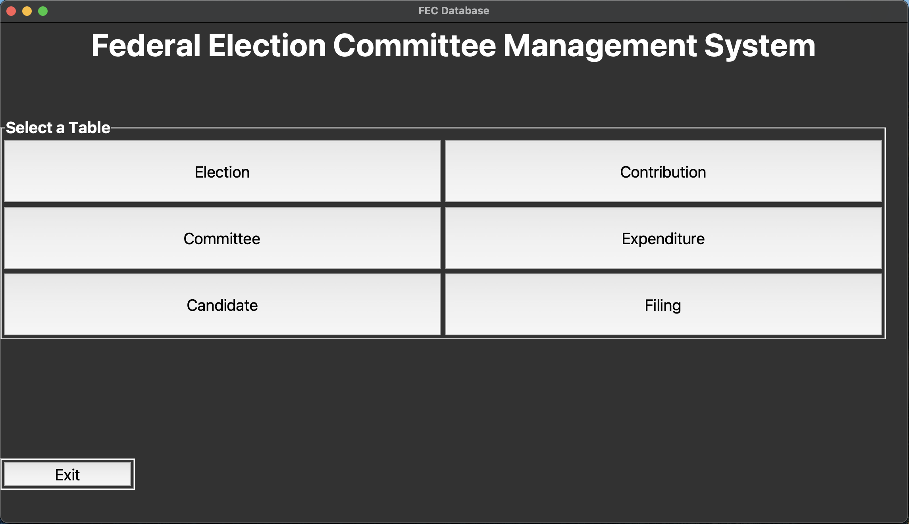

# mySQL-Election-Project (Database Manager)
## Overview:
The purpose of this project is to create a graphical user interface (GUI) or Console that a user can use to record, store, and manage FEC data across candidates and campaign organizations (Database Manager).
## Features
- GUI and console-based access to FEC data
- Add, edit, and delete candidate and organization records
- View and query campaign-related information
- Easy-to-use MySQL connection and schema setup
- Connection testing script for debugging
## Requirements:
In order to run this application your python must be up to date and you must have the mySQL connecter package downloaded. The mySQL connector package can be downloaded by running the command `pip install mysql-connector-python`

## Project Files:
### `FEC_DB_app.py`:
This file contains the code that creates the GUI that allows a user to interact with the FEC database.
Side note: Make sure to modify the password variable with your mySQL password and the database variable with the name of FEC database so that database properly connects with the GUI. These variables are located at the top of the file under the "SQL Database Connection" section.
### `FEC_DB_Console.py`:
This file performs the same functions as the GUI except that it is in controlled in the terminal.
### `FEC_DB_Ready.sql`:
This file contains mock data to establish the database (schemas) in mySQL. This must be ran before running either the GUI or Console version of database manager so that the connection can be successful between the application and database.
### `testConnecion.py`:
This file serves only to test that you are able to establish a connection to your database in mySQL.
## Demo:
### Main Menu Screenshot

### Preview Demo

## Contact
Feel free to reach out if you have questions or suggestions for improvement!
